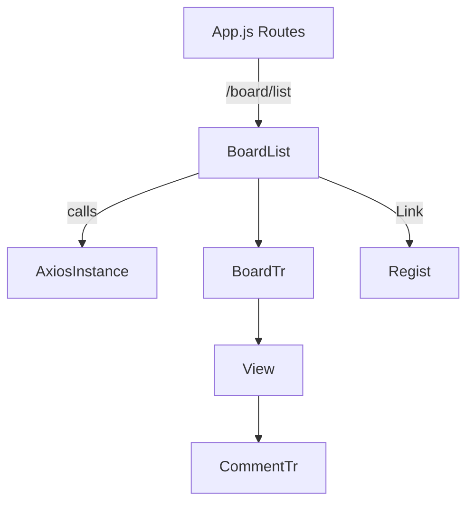

# BoardList.js 코드 분석

아래는 `src/component/board/BoardList.js` 의 주요 동작을 설명한 내용입니다. 각 코드 라인 옆에는 주석으로 동작을 표기했습니다.

```javascript
1 import React, { useState, useEffect, useRef } from "react"; // React 훅 로드
2 import BoardTr from "./BoardTr";                           // 게시글 행 컴포넌트
3 import { Link } from "react-router-dom";                    // 링크 기능 사용
4 import axiosInstance from "../../util/axiosInstance";       // 커스텀 axios 인스턴스
5 
6 function BoardList() {
7   const [data, setData] = useState(null);                    // 게시글 데이터
8   const [loading, setLoading] = useState(true);              // 로딩 상태
9   const [totalElements, setTotalElements] = useState(0);     // 총 게시글 수
10  const [totalPages, setTotalPages] = useState(0);           // 총 페이지 수
11  const [currentPage, setCurrentPage] = useState(0);         // 현재 페이지
12  const [pageList, setPageList] = useState([]);              // 페이지 번호 목록
13  const [prevPage, setPrevPage] = useState({});              // 이전 페이지 정보
14  const [nextPage, setNextPage] = useState({});              // 다음 페이지 정보
15  const [param, setParam] = useState({ page: 1 });           // API 파라미터
16  let searchType = useRef(null);                             // 검색 타입 ref
17  let searchWord = useRef(null);                             // 검색어 ref
18 
19  const getApi = async () => {
20    try {
21      const response = await axiosInstance.get("/api/reply/list", { params: param });
22      const res = response.data;
23      setData(res.result.content);                            // 목록 데이터 저장
24      setTotalElements(res.result.totalElements);
25      setTotalPages(res.result.totalPages);
26      setCurrentPage(res.result.number + 1);
27      setPageList(res.pageList);
28      setPrevPage(res.prevPage);
29      setNextPage(res.nextPage);
30      setLoading(false);                                      // 로딩 완료
31    } catch (error) {
32      console.error("API 요청 실패:", error);
33      sessionStorage.removeItem("accessToken");
34    }
35  };
36 
37  useEffect(() => {
38    getApi();                                                 // 파라미터 변경 시 목록 재호출
39  }, [param]);
40 
41  const search = (e) => {
42    e.preventDefault();
43    setParam({
44      ...param,
45      page: 1,
46      searchType: searchType.current.value,
47      searchWord: searchWord.current.value,
48    });
49  };
50 
51  return (
52    <>
53      <div className="sub">
54        <div className="size">
55          <h3 className="sub_title">게시판</h3>
56          <div className="bbs">
57            <p>
58              <span>
59                <strong>총 {totalElements}개</strong> | {currentPage}/{totalPages} 페이지
60              </span>
61            </p>
62            <table className="list">
63              <caption>게시판 목록</caption>
64              <colgroup>
65                <col width="80px" />
66                <col width="*" />
67                <col width="80px" />
68                <col width="100px" />
69                <col width="100px" />
70              </colgroup>
71              <thead>
72                <tr>
73                  <th>번호</th>
74                  <th>제목</th>
75                  <th>조회수</th>
76                  <th>작성자</th>
77                  <th>작성일</th>
78                </tr>
79              </thead>
80              <tbody>
81                {loading ? (
82                  <tr>
83                    <td colSpan="5">
84                      <div>
85                        
86                        <p><b>데이터를 불러오는 중입니다...</b></p>
87                      </div>
88                    </td>
89                  </tr>
90                ) : data ? (
91                  data.map((row, i) => <BoardTr row={row} key={i} />)
92                ) : (
93                  <tr>
94                    <td className="first" colSpan="5">등록된 글이 없습니다.</td>
95                  </tr>
96                )}
97              </tbody>
98            </table>
99            <div className="btnSet" style={{ textAlign: "right" }}>
100             <Link className="btn" to="/board/regist">글작성</Link>
101           </div>
102           <!-- 이하 페이징 및 검색 폼 코드 생략 -->
103         </div>
104       </div>
105     </div>
106   </>
107  );
108 }
109 
110 export default BoardList;
```

## 컴포넌트 흐름



위 다이어그램은 App.js에서 시작해 게시판 목록을 불러오고 상세 보기와 댓글 컴포넌트까지 이어지는 흐름을 간략히 나타냅니다.
